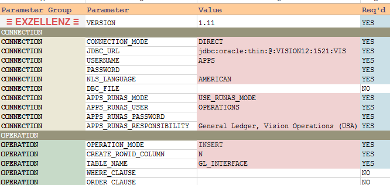

Connection Mode<a href="INDEX.md">Index</a>

---
 
- For DIRECT connection mode, you need to specify the `JDBC URL`, `USERNAME`, and `PASSWORD`.

- The `PASSWORD` value is hidden in the Cell, but user can see it if the cell is selected. So if this template file is distributed to end user, one should password-lock this cell from selecting.

- You can connect to the EBS database using `APPLICATION` mode.  Please read [Doc ID 974949.1](https://support.oracle.com/epmos/faces/DocumentDisplay?id=974949.1) for the details about this kind of connection.  For this connection mode, you need to specify `USERNAME` (which is the EBS user, aka FND User), `PASSWORD` (for this EBS user, not DB password), and `DBC_FILE` location.

- If you need to download data from database views which require session language parameters (e.g. TL tables in EBS), you can specify that language in `NLS_LANGUAGE`.

- The `APPS_RUNAS_MODE` allows the program to connect EBS database using a specific EBS user.

- If you need to download data from Org-specific database views, you can specify the `APPS_RUNAS_USER`, `APPS_RUNAS_PASSWORD`, and `APPS_RUNAS_RESPONSIBILITY`, which is the responsibility full name in the language specified in `NLS_LANGUAGE`. A database session will be created under this user, responsibility, and language.  The Org ID specified for this responsibility will be used.

- For example, you want to connect to EBS database and upload data to `GL_INTERFACE` table. You ask your users to enter their EBS credentials.  Then the upload process will able to populate the `CREATED_BY` column and then we can find out who did the upload.

