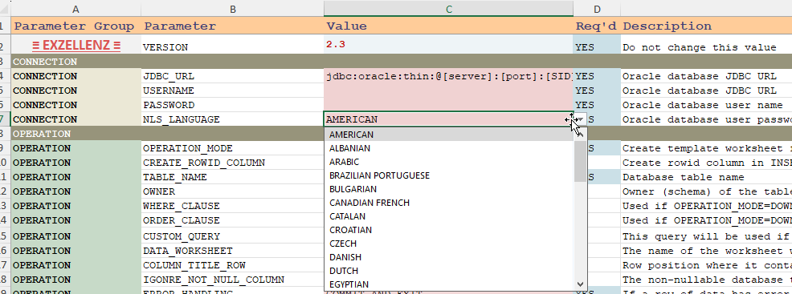

Connection Mode<a href="INDEX.md">Index</a>

---
 
-  Enter the `JDBC URL`, `USERNAME`, and `PASSWORD`.  

- The `PASSWORD` value is hidden in the Cell.  After this Excel file is processed by this application, the plain text password value will be encrypted.

- If you need to download data from database views which require session language parameters (e.g. TL tables in EBS), you can specify that language in `NLS_LANGUAGE`.

