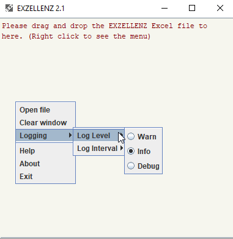

How to Use<a href="INDEX.md">Index</a>

---

## Installation
- Unzip the archive `exzellenz-2.0.zip` to any directory
- Make sure you are using **JRE 8** or higher
- Run `EXZ.exe` / `EXZ.bat` / `EXZ.sh` to start the GUI version
- Run the `EXZELLENZ.bat` / `EXZELLENZ.sh` for the console-based version. It takes one argument  (Excel file in full path).

## How the Program Works

There are 2 template files provided:

- exz_template_[vesrion].xls (97-2003 format)
- exz_template_[vesrion].xlsx (2007 or later format)

Database connection information and operation directives are stored in the worksheet called `EXZELLENZ` in the template file.

> **You should make a copy of this template file and add your parameters in this file.**

Start the program, and you can drag-and-drop the template file to the program.  The program read the parameters, then start the download / upload / update / delete operation accordingly.

Operation information log is shown in the program.

A new file will be created after the operation has done.  his new file contains operation result for each row of data processed.

The configuration file `EXZ.properties` is present in the same directory.

## GUI Interface

Run `EXZ.exe` or `EXZ.sh`

You can either drag-and-drop the Excel file to the program, or use popup menu (right click) -> Select File, to kick off the process.

If `SAVE_NEW_FILE` is set to `N`, the selected Excel file will be updated with the process result. If it is set to `Y`, for any successful operation a new Excel file which stored the result will be created. File name is the same as the original one and suffixed by (n), where n = 1,2,...n, if `NEW_FILE_NAME` is not specified.  

By default, parameter `CONFIRM_OPERATION` is set to `Y`.  After the Excel file is picked up, the program will pause for user's confirmation. Set it to `N` if you want to run this program without interruption. 

You can change Log Interval in the pop-up menu. The program shows message to tell much many line of data has been processed. Default is 100, and other possible values are 10, 50, 500, and 1000.

## Command Line Interface

Run the program `EXZELLENZ.bat` or `EXZELLENZ.sh`. It takes one argument - the Excel file name.

EXZELLENZ.bat/sh [Excel file name with full path]

> e.g. EXZCELLENZ.bat "C:\My Document\example.xls"

Please use double quote if the path or file name contains space.
