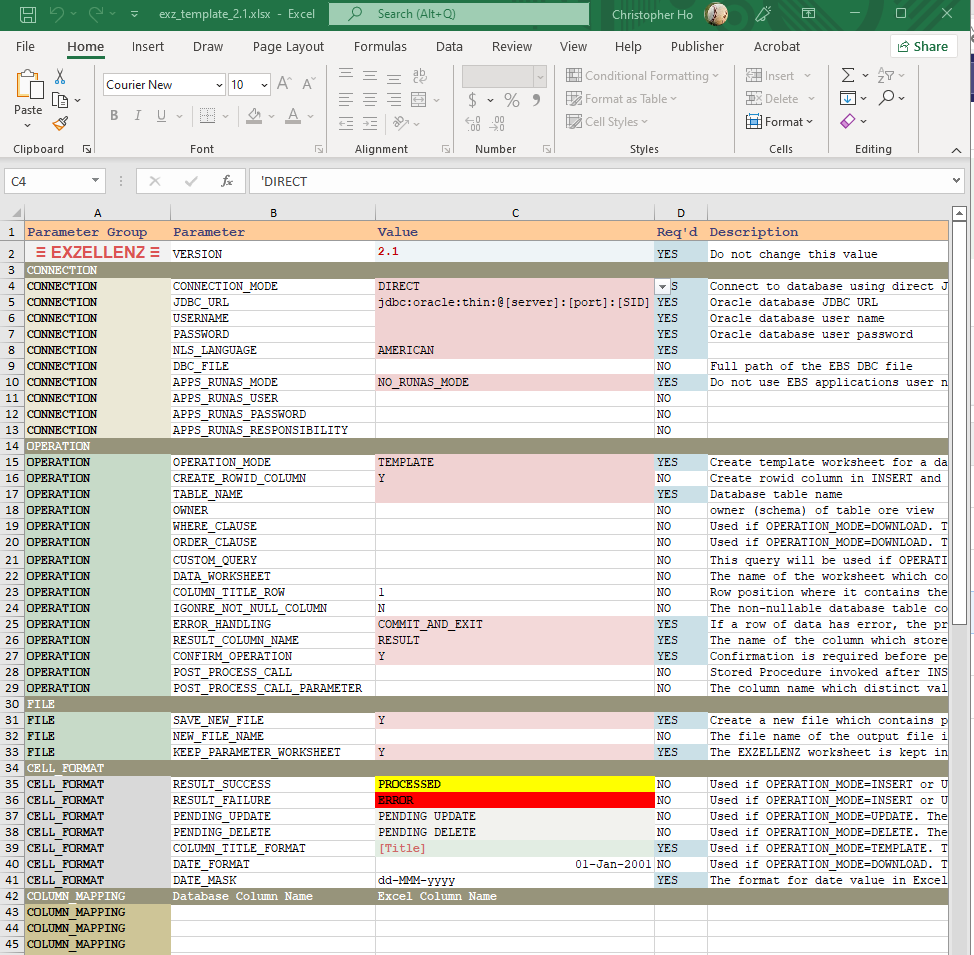

Parameter Groups<a href="INDEX.md">Index</a>

---

| Parameter Group | Description |
| --- | --- |
| CONNECTION | How the program connects to database |
| OPERATION | Operation mode, database / query information, and options which are responsible for different situations |
| FILE | How the output file is created |
| CELL FORMAT | The cell formats and date formats used in the result worksheet |
| COLUMN MAPPING | How the column titles and table columns are related |

