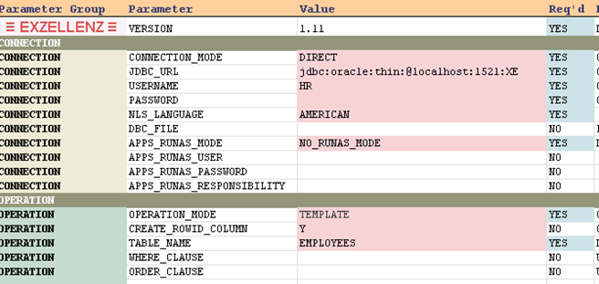
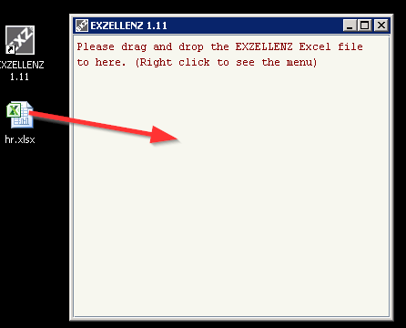
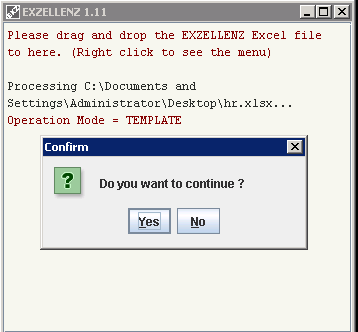
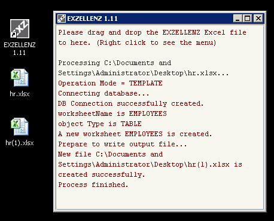

# About

> For all tutorials, steps and screenshots are operated through Office 2013 64-bit under Microsoft Windows 7.  Database is Oracle XE 11gR2.

- This tutorial uses the Oracle sample schema HR to demonstrate the features of EXZELLENZ.  By default this schema is locked so you might need to unlock the user account first (alter user HR account unlock; alter user HR identified by HR).

- Since EXZELLENZ can be executed in any platform, the following steps are generic and not specific to any OS.  The only requirement is that you must have Java Runtime library 6 or higher is installed.  You can use Microsoft Office or Open/Libre office to open the Excel file.

# Tutorial - Part 1

## Template Mode

Make a copy of template file exz_template_1.11.xlsx and name it as hr.xlsx.  Move this file to Windows Desktop.  By Default this file is read-only, so remove the read-only property of this file.

Open hr.xlsx, and fill in the JDBC URL (in a form of `jdbc:oracle:thin:@[server]:[port]:[sid]`), username and password.  Make sure the OPERATION_MODE is TEMPLATE, and enter EMPLOYEES as TABLE_NAME value. Save and close the file.

Start the program.  Drag-and-drop the file hr.xlsx to the program window.  Click "Yes" to continue the process.

Progress can be seen in the program window.  When the process has finished, a new file hr(1).xlsx is created.

