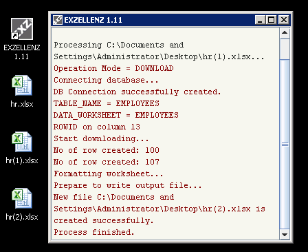
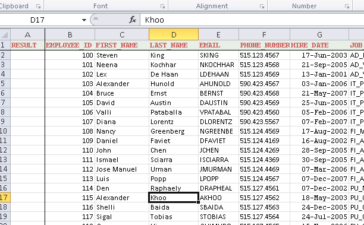

Tutorial - Part 2<a href="../INDEX.md">Index</a>

---

## Download Mode

Open file `hr(1).xlsx` and select EXZELLENZ worksheet.  Change the `OPERATION_MODE` to **DOWNLOAD**. Save and close the file.

Start EXZELLENZ, move the mouse cursor to the program window, and right-click to see the menu.  Select Open File and choose `hr(1).xlsx` from Window Desktop (This is another way to select Excel file to process).  The action will start immediately.

A new file `hr(2).xlsx` is created.  Open this file and you should see the data in table EMPLOYEES is populated in the worksheet.

