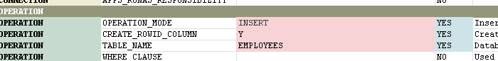
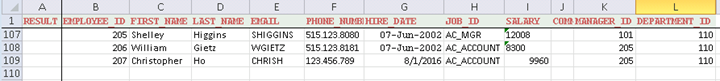
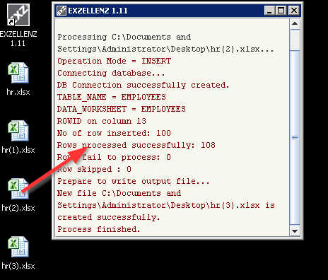
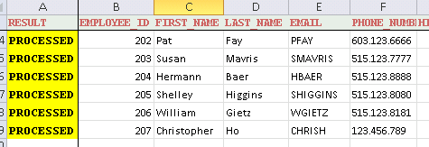
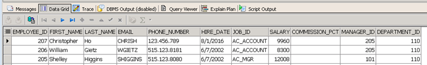

Tutorial - Part 3<a href="../INDEX.md">Index</a>

---

## Insert Mode

Connect the database using any SQL tool (e.g. SQL*Plus) under schema HR and run the followings:
~~~sql
alter table DEPARTMENTS disable constraint DEPT_MGR_FK;
alter table JOB_HISTORY disable constraint JHIST_EMP_FK;
alter trigger UPDATE_JOB_HISTORY disable;
truncate table EMPLOYEES;
~~~

Open `hr(2).xlsx` and change the `OPERATION_MODE` to **INSERT**.

Insert another line of data (line 109) in the EMPLOYEES worksheet that:

| COLUMN | Cell Value |
| --- | --- |
| EMPLOYEE_ID | =B108+1 |
| LAST_NAME, FIRST_NAME, EMAIL, PHONE_NUMBER | _any values_ |
| HIRE_DATE | =TODAY() |
| JOB_ID | =H108 |
| SALARY | =I108*1.2 |
| MANAGER_ID | =K108 |
| DEPARTMENT_ID | =L108 |

Start EXZELLENZ and drag-and-drop the file `hr(2).xlsx` to program window.  The program will read the Excel file and insert the data back into the database table EMPLOYEES.

A new file `hr(3).xlsx` is created.  Open this file and you should see that in the worksheet EMPLOYEES, the first column RESULT has the word **PROCESSED** populated for each row of data.  Connect to database under schema HR and select the new row of data you just added. 

Using SQL query and see the new row of data. The data derived from Excel formula is evaluated and stored in the table properly. 
~~~
select * from EMPLOYEES order by EMPLOYEE_ID desc
~~~

