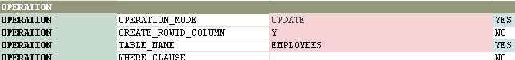
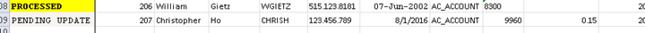
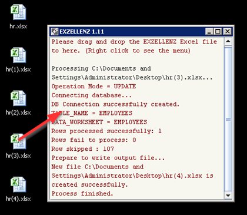
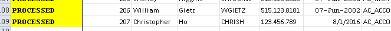
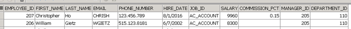

# Tutorial - Part 4
## Upload Mode

Open the file hr(3).xlsx.  For the row of data you just added in Part 2, change the JOB_ID to SA_REP. Add a value of 0.15 in the COMMISSION_PCT field.

 In the EXZELLENZ worksheet, change the OPERATION_MODE to UPDATE. Copy the cell C33 (PENDING_UPDATE) to the new row of the result column in the worksheet EMP.  Save and close the file.

Start EXZELLENZ, drag-and-drop the file hr(3).xlsx to the program window.  When the action has done, you should see there has a line in the log `Rows processed successfully: 1.`

Open the file hr(4).xlsx and you should see the result column has changed from PENDING_UPDATE to PROCESSED.

Use any SQL tool to see whether the updated values are correct in the database table EMP.

