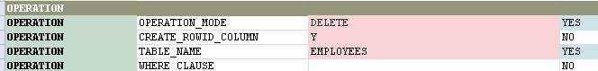
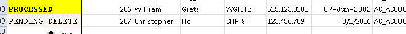
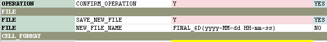
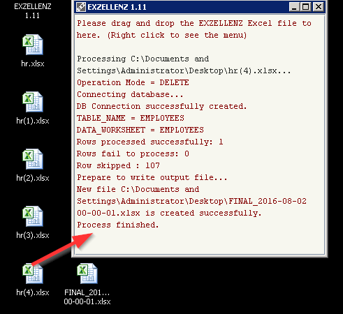
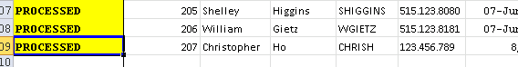
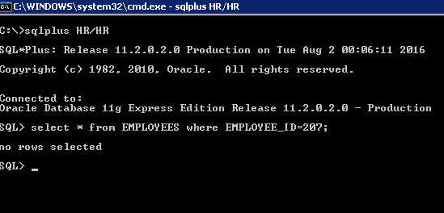

# Tutorial - Part 5

## DELETE MODE

Open the file hr(4).xlsx, copy the cell C34 (PENDING_DELETE) in EXZELLENZ worksheet to the cell of the result column in the newly-added row.  Change the OPERATION_MODE to DELETE in the EXZELLENZ worksheet. 

Add value for NEW_FILE_NAME parameter so that the output Excel file has timestamp in the file name.  The syntax for timestamp is the same as the one used in [Java timestamp class](https://docs.oracle.com/javase/7/docs/api/java/sql/Timestamp.html), and the syntax is enclosed by $D{ ... }.  Put "FINAL_$D{yyyy-MM-dd HH-mm-ss}" for this value.  Save the file.

Start EXZELLENZ, Drag-and-drop the file hr(4).xlsx to the program window.  When the process has done, you should see `Rows processed successfully: 1` in the program window.

Open the file FINAL_{timestamp}.xlsx and check the RESULT column for the last row of data.  It should be changed from PENDING_DELETE to PROCESSED.

Use any SQL tool to check whether the row of data asked for deletion is indeed deleted in the database table EMP.

