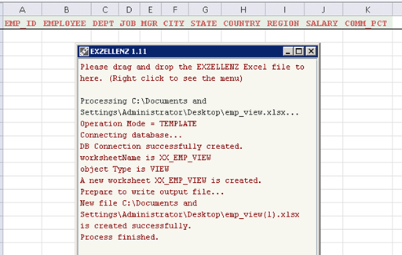
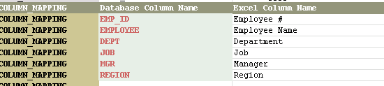
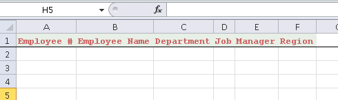
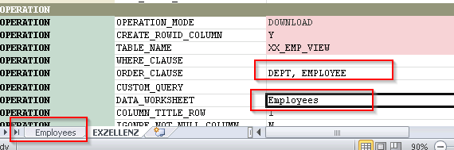
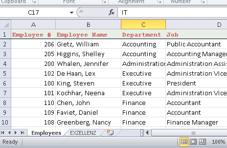

<span style="font-size:36px;">Tutorial - Part 6</span><span style="padding-left: 300px;text-align:right;font-size:14px"><a href="../INDEX.md">Index</a></span>

---

## USING VIEWS AND CUSTOM COLUMN NAMES

Under HR schema, create a view `XX_EMP_VIEW` by this SQL

```SQL
CREATE OR REPLACE VIEW XX_EMP_VIEW (
EMP_ID, EMPLOYEE, DEPT, JOB, MGR, CITY, STATE,
COUNTRY, REGION, SALARY, COMM_PCT
) AS
   SELECT e.employee_id,
          e.last_name || ', ' || e.first_name employee,
          d.department_name,
          j.job_title,
          e2.last_name || ', ' || e2.first_name manager,
          l.city,
          l.state_province,
          c.country_name,
          r.region_name,
          e.salary,
          e.commission_pct
     FROM employees e,
          departments d,
          jobs j,
          locations l,
          countries c,
          regions r,
          employees e2
    WHERE     e.department_id = d.department_id
          AND d.location_id = l.location_id
          AND l.country_id = c.country_id
          AND c.region_id = r.region_id
          AND j.job_id = e.job_id
          AND e2.employee_id(+) = e.manager_id;
```

Make a copy of the `hr.xlsx` (in Part I) into `emp_view.xlsx`. Open this file, use `XX_EMP_VIEW` as table name.  Save and close this file.

Start EXZELLENZ and drag-and-drop file `emp_view.xlsx` to the program window.  When it's done, open the file `emp_view(1).xlsx` and you should see the column names were populated in worksheet `XX_EMP_VIEW`.  Columns RESULT and the hidden column ROWID are not present because database view cannot do any DML through this program.



When `emp_view(2).xlsx` is still open, go to EXZELLENZ worksheet and change the `OPERATION_MODE` to `DOWNLOAD`.

Remove all columns except EMP_ID, EMPLOYEE, DEPT, JOB, MGR, REGION.  Change

Add the custom column names mapping in EXZELLENZ worksheet as follows:



Change the column header in `XX_EMP_VIEW` worksheet as specified in this mapping (you can use Copy -> Paste [Transpose]) to do the trick.



Change the Worksheet name from `XX_EMP_VIEW` to "Employees".  Put "Employees" the DATA_WORKSHEET parameter, as shown. Add "DEPT, EMPLOYEE" in the `ORDER_CLAUSE` parameter.



Save and close the `emp_view(2).xlsx`.  Start EXZELLENZ, drag-and-drop this file to the program window.  When it's done, a new file `emp_view(3).xlsx` is created.  Open the Excel file and you should see the data is populated.




