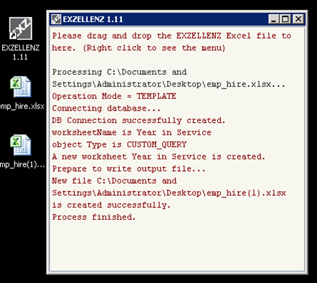

# Tutorial - Part 7

## Using Custom Query 

Make a copy of the hr.xlsx (in Part I) into emp_hire.xlsx. Open this file, enter the following SQL into CUSTOM QUERY value (just copy and paste the SQL into the Excel cell).  Enter "Year in Service" for DATA_WORKSHEET value.  Make sure the OPERATION_MODE is TEMPLATE.

```
select e.employee_id emp_id
     , e.last_name || ', ' || e.first_name full_name
     , j.job_title
     , e.email || '@abc.com' email
     , trim(to_char(e.salary, '999,990')) salary
     , e.hire_date
     , trunc(months_between(sysdate, e.hire_date)/12) || ' Y ' || 
       mod(trunc(months_between(sysdate, e.hire_date)),12) || ' M' yr_in_service
  from employees e
     , jobs j
 where e.job_id=j.job_id
 order by e.hire_date
```




Run emp_view.xlsx in EXZELLENZ and a new file emp_view(1).xlsx is created.  Open this file and change OPERATION_MODE to DOWNLOAD.  Save and close this file.  Run this file in EXZELLENZ again.  When it's done, open the file emp_view(2).xlsx and it should look like this:

